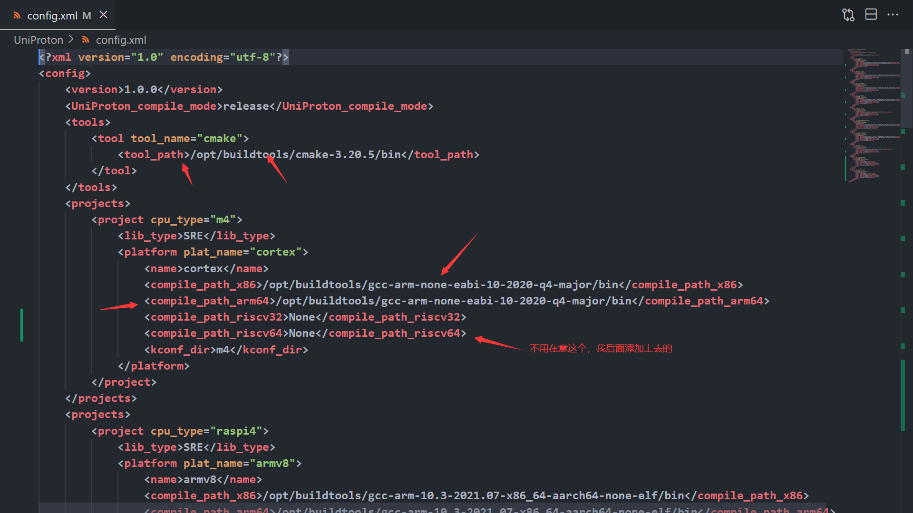
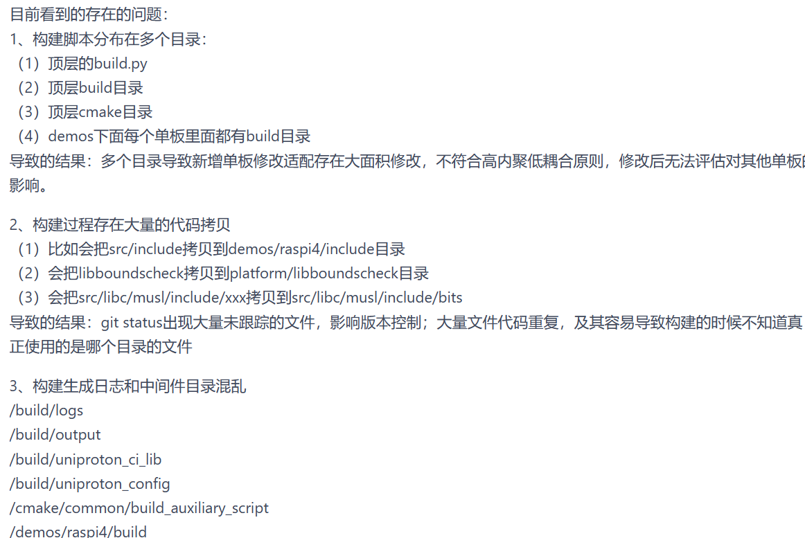
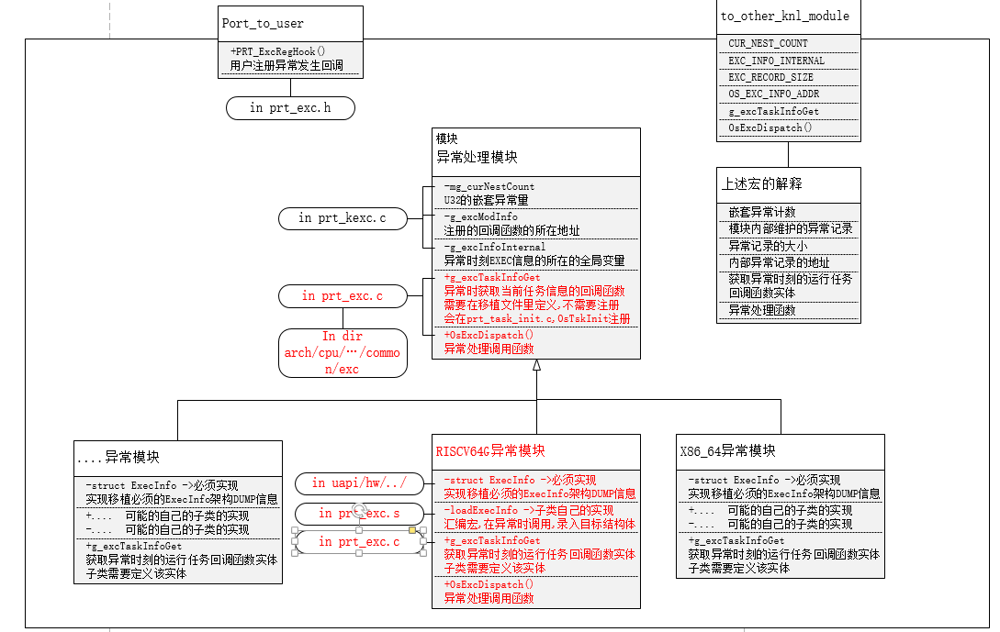

# UniProton移植记录

**源仓库链接：**[UniProton: A lightweight real-time operating system (gitee.com)](https://gitee.com/openeuler/UniProton)

### 此文档相关的内容仅仅作为本人的最新更进日志，以及一些心得和吐槽

### 可能会带有当天的情绪什么的，慎入！！！！

### 宇宙超级无敌免责声明： 以下所有内容均不代表我对UniProton项目的个人评价

### [更技术向的解析移植文档请移步此处](UniProton_technic.md)

## 2024-01-07

- 距离开始看UniProton已经有3天左右了，根据以往对一些RTOS的移植经验，我以为我能够比较快摸清楚UniProton的框架代码结构，但是现在甚至没有开始真正的src kernel部分的代码，还在他的构建框架里摸爬滚打。

- 目前进度
  - 大约是在UniProton的构建框架的探索过程的中间吧

- 今日破防的吐槽
  - 我不理解为什么构建框架这么奇怪，给我的感觉是东一块，西一块拼凑起来的，没有文档！！！！！！！！！！！
  - 构建框架开闭原则好像是没遵守，当我尝试去移植RISCV架构相关的代码的时候，需要对构建系统大开刀，非常的裂开！！！
  - 构建框架依赖倒置原则好像是么i遵守，对于编译器路径的依赖路径居然要固定的？？？？！！！！这意味着你的整个项目代码的目录框架的绝对路径是写死了的？？？！！！编译器名，编译器版本都是写死的，构建工具路径也写死了？？！！
  - 
  - 非常好代码，破防来自开发者
  - 【今天是2024.1.8号，经过对构建框架的调试后，进行补充，上面的图的compile_path_x86 不是交叉x86编译器的绝对路径，是Host架构为X86的时候的编译器路径，也就是如果想要编译不同架构的内核LIB，需要自己手动改动对应的绝对路径】

  ## 2024-01-08

- 今日计划
  - 优先跳过代码构建框架，查看源码框架，把更多精力放到移植上去，而不是理解构建框架上面去
  - 熟悉arch目录结构，以及移植需要添加的文件

- 目前进度
  - 理解了mem子模块的架构和提供的API接口
  - 正在查阅arch子模块向其他子模块提供的接口
  - 正在以raspi4为目标理解arch子模块的各个接口
  - 目前尚无可外见的进度

- 今日份反转
  - Kernel下分层出来的框架非常舒适，非常好代码，爱来自开发者
  - 看到些issue ，便释怀了，原来不止我这么觉得
  - 
  - 

  ## 2024-01-10

  - 今日计划
    - 移植一些基础的架构相关的函数，如 临界区进出以及其他可能使用的基架型的函数
    - 继续整理UniProton的代码结构
    - 移植异常模块函数【继承异常模块，补充 ExecInfo结构体，提供在发生异常时需要使用的汇编宏，方便录入异常信息】
    - 继续整理以及画出模块之间的UML图
  - 目前进度
    - 从源仓库里抽取了纯粹的内核部分以及基础组件的代码【去除构建框架，额外的组件，提供的各种额外的lib库的接口】
    - 画了异常模块的UML图，以及移植需要继承实现的一些结构体和函数
    - 其中红色标记是需要进行**RISCV移植**的地方
    - 
  - 预期后续进度
    - 自底向上和自顶向下同时进行，先整理所有的基础公共库相关的模块，同时把相关的中断模块，TICK模块，以及其他硬件相关模块进行移植。
    - 整理初始执行流，也就是main函数对各个模块的初始化过程
    - 先对每个模块画出UML图，再真正写代码进行移植

## 2024-01-11

- 孩子今天好不容易把考试都考完了，半休息一天（
- 其实中午临近下午考试的时候还是看了一下中断模块的相关内容，但是没像异常模块那样搞的比较完整
- 明天回家后再接再厉！

## 2024-01-12

- 今日最新进度
  - 完成EXC异常模块的移植代码
  - 正在整理HWI硬件中断模块的代码
  - 预计在明天完成HWI硬件中断模块的UML图产出

## 2024-01-14

- 今日最新进度
  - 移植完了HWI中断模块的代码
  - 移植了基础公共架构库需要的宏定义
  - 搞了个简单的QEMU-RV-SYSTEM环境，把框架搭好了，MAKEFILE，链接文件啥的，明天开始跑异常模块和中断模块的测试
- 预计明天进度
  - 文档关于中断模块的跟上代码进度
  - 文档关于基础公共库和基础的架构库跟上代码进度
  - 着手开始搞已移植模块的测试

## 2024-01-15

- 今日最新进度
  - 适配了构建框架，因为构建框架并不会执行链接，只是把所有.o打成一个包丢给用户，所以还并未进行运行时的测试
  - 正在产出公共基础库文档
  - 正在产出hwi模块的文档
- 预计明日进度
  - 继续产出相关文档，同时产出模块依赖关系
  - 继续移植代码

## 2024-01-16

## 2024-01-17

## 2024-01-18

## 2024-01-19

- 今日最新进度
  - 这几天都没有写文档，在爆肝代码，没有时间来写文档了
  - 适配了构建框架，适配了UniProton代码，在qemu-virt上跑起来了，写了一个简单的应用，作用类似SHELL
  - 相当于验证了一下中断框架的适配以及信号量sem模块的适配，明天再测试一下其他模块，测试完了就提交pr了
  - 整完了再写文档

## 2024-01-20

- 今日最新进度
  - 在uapi上 写了一个简单的shell 测试了一下，测了IPC 和任务 以及中断 异常模块的代码
  - 提了PR，等待maintainer code review
  - 文档后面有时间会接着出，准备开始移步sysboost！
  - 文档断更纯粹因为懒（），一开始肝代码就没什么时间写文档了，后面有时间接着更
  - 至于为啥不是必须更，（赣，我更想更sysboost的文档，这个太诱惑人了，之前很长一段时间都是在做 RTOS这方面内核层次的，后面其他模块的技术大概也明白，【消息队列，信号量，这些IPC是怎么做的，以及其他一些特性】），对我来说，SYSBOOST看起来更有吸引力 （爱了爱了，开始学rust!!!! 来点链接器魔法！）

## 2024-02-12

- 今日最新进度

  - 断更人继续更新，**在完善完UniProton的RISCV相关生态前，应该是不会断更了**【或者后续有人接手我再看看其他的OE项目**继续更其他的项目**】
  - 文档相关的还是根据情况进行更新，目前仓库主要跟进UniProton RISCV 相关生态的更新
  - 今日测试完了UniProton以下RTOS的几个实时性能测试指标
    - 上下文切换时间
    - 任务抢占时间
    - 消息队列延时
    - 信号量混洗时间
    - 死锁解除时间
  - 需要继续测试的UniProton实时性能指标：中断性能指标
    - 这里因为需要手动触发中断，RISCV qemu下能手动触发的就是软件中断了，或者IPI中断【有知道其他可以手动触发的中断的UU务必联系我，MY 微信 : Jer6y 十分感谢！ 目前是试了一下直接写PLIC的PENDING寄存器，没办法写进去，没办法手动触发】
    - IPI 这个中断在RISCV比较特殊 ，直接是CLINT管理的，没有硬件中断号，所以需要想一些方法适配 UniProton的中断API框架，包括分配一个固定的软件中断号，适配对应API【因为和一般的中断处理不一样，需要利用宏定义做额外的处理】，简要来说就是 **CLINT 去适配 UniProton的中断框架，**方便后续测试以及MCS相关的部署

- 预计后续进度

  - 拉取一下 UCOSIII RISCV64的Kernel部分的代码，自己写或者找一个可移植的框架【目前暂定为自己写，害怕性能测试由于和UniProton侧的算法不一致导致了一些误差】
  - 做个MCS的广告？，后续继续持续学习Linux内核驱动

  