# UniProton实时性性能测试报告

[TOC]


## 测试标准 - rhealstone

- [实时系统性能测试指标及方法_实时操作系统 死锁解除时间 测试-CSDN博客](https://blog.csdn.net/changexhao/article/details/80348027)
- [Zephyr与FreeRTOS实时性测试比较分析 - wangyw - 博客园 (cnblogs.com)](https://www.cnblogs.com/fozu/p/16016426.html)
- [Microsoft Word - 专论综述1.doc (c-s-a.org.cn)](http://c-s-a.org.cn/csa/article/pdf/20150105)
- [嵌入式实时操作系统性能测试方法研究 (uml.org.cn)](http://www.uml.org.cn/Test/200906119.asp)

## 测试原理以及代码

### 上下文切换时间

- **测试原理**
  - **测试时间段细节**： **上文保存**  ->  调度器选择其他线程[**调度器算法执行**] -> **下文加载**
  - **RTOS测试函数支持:**  
    - **UniProton** : `OSSchedRoundRobinYield()`
    - **uC-OS3：**`PRT_TaskDelay()`
  - **RTOS关于时间相关支持**
    - **UniProton** : `benchmark_timer_initialize`，`benchmark_timer_read`
    - **uC-OS3：**``benchmark_timer_initialize`，`benchmark_timer_read`
    - **上述的函数自行实现**
      - `benchmark_timer_initialize` : 记录模块现在的时间，单位自己根据实现自行确定
      - `benchmark_timer_read` ：返回距离上次记录的时间，单位自己根据实现自行确定
  - **具体实现细节流程图**
    - 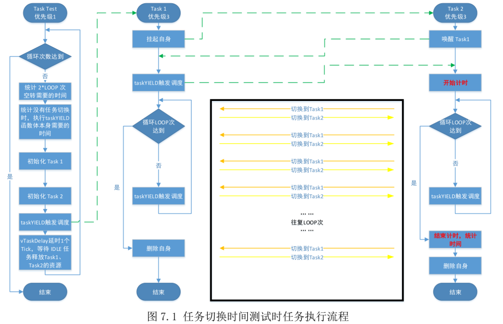

### 任务抢占时间

- **测试原理**
  - **测试时间段细节**： **高优先级任务进入就绪队列**  ->  **调度器发现并抢占当前任务** -> **低任务上文保存** -> **高任务下文加载**
  - **RTOS测试函数支持:**  
    - **UniProton** :`PRT_TaskResume`，`PRT_TaskSuspend` 
    - **uC-OS3** :`OSTaskSuspend`，`OSTaskResume`
  - **RTOS关于时间相关支持**
    - **UniProton** :  见上文
    - **uC-OS3** :  上文
    - **上述的函数自行实现**
      -  见上文
  - **具体实现细节流程图**
    - 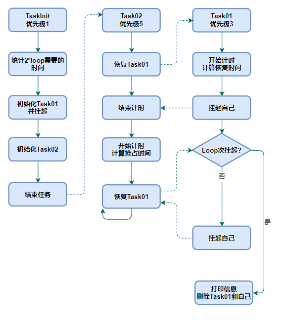

### 信号量混洗时间

- **测试原理**
  - **测试时间段细节**： **信号量释放**  ->  **将等待信号量的任务移到就绪队列** -> **就绪队列数据结构调整状态** 
  - **RTOS测试函数支持:**  
    - **UniProton** :`PRT_TaskResume`，`PRT_TaskSuspend` ，`Sem系列API`
    - **uC-OS3** :`OSTaskSuspend`，`OSTaskResume`，`Sem系列API`
  - **RTOS关于时间相关支持**
    - **UniProton** :  见上文
    - **uC-OS3** :  上文
    - **上述的函数自行实现**
      -  见上文
  - **具体实现细节流程图**
    - 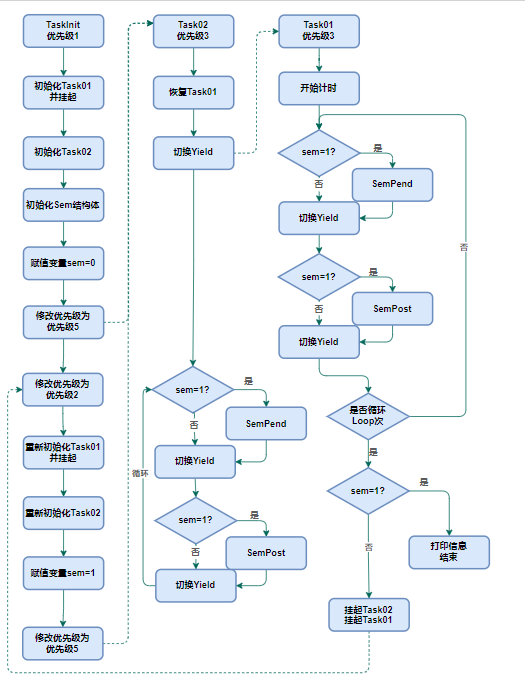

### 消息延迟

- **测试原理**

  - **测试时间段细节**： **消息队列消息放置**  ->  **将等待消息的任务移到就绪队列** -> **就绪队列数据结构调整状态** 

  - **RTOS测试函数支持:**  
    - **UniProton** :`PRT_TaskResume`，`PRT_TaskSuspend` ，`Msg系列API`
    - **uC-OS3** :`OSTaskSuspend`，`OSTaskResume`，`Msg系列API`

  - **RTOS关于时间相关支持**
    - **UniProton** :  见上文
    - **uC-OS3** :  上文
    - **上述的函数自行实现**
      -  见上文

  - **具体实现细节流程图**
    - **实现方式与信号量混洗十分相似，请查阅信号量混洗，对比源码进行理解**

### 死锁解除

- **测试原理**
  - **测试时间段细节**： **信号量释放**  ->  **将等待信号量的任务移到就绪队列** -> **就绪队列数据结构调整状态** 
  - **RTOS测试函数支持:**  
    - **UniProton** :`PRT_TaskResume`，`PRT_TaskSuspend` ，`Sem系列API`
    - **uC-OS3** :`OSTaskSuspend`，`OSTaskResume`，`Sem系列API`
  - **RTOS关于时间相关支持**
    - **UniProton** :  见上文
    - **uC-OS3** :  上文
    - **上述的函数自行实现**
  - **具体实现细节流程图**
    - **实现方式与信号量混洗十分相似，请查阅信号量混洗，对比源码进行理解**

### 实现代码

- **UniProton** :  **testcases**目录中
- **uC-OS3** :  [Jer6y/ucosiii-riscv (github.com) ](https://github.com/Jer6y/ucosiii-riscv)仓库中，按照文档配置环境编译运行即可

## 测试环境与测试表现

### 测试环境

- qemu

  - 版本: 7.2.7

  - 参数: `qemu-system-riscv64 -bios none -smp  1 -m 512M -nographic -machine virt -kernel...`

  - qemu的硬件信息设备树【详细的设备信息可以查看下面的设备树，如时钟频率等】

    - ```c
      /dts-v1/;
      
      / {
      	#address-cells = <0x02>;
      	#size-cells = <0x02>;
      	compatible = "riscv-virtio";
      	model = "riscv-virtio,qemu";
      
      	pmu {
      		riscv,event-to-mhpmcounters = <0x01 0x01 0x7fff9 0x02 0x02 0x7fffc 0x10019 0x10019 0x7fff8 0x1001b 0x1001b 0x7fff8 0x10021 0x10021 0x7fff8 0x00 0x00 0x00 0x00 0x00>;
      		compatible = "riscv,pmu";
      	};
      
      	fw-cfg@10100000 {
      		dma-coherent;
      		reg = <0x00 0x10100000 0x00 0x18>;
      		compatible = "qemu,fw-cfg-mmio";
      	};
      
      	flash@20000000 {
      		bank-width = <0x04>;
      		reg = <0x00 0x20000000 0x00 0x2000000 0x00 0x22000000 0x00 0x2000000>;
      		compatible = "cfi-flash";
      	};
      
      	chosen {
      		rng-seed = <0x21163f2d 0xc0c1a870 0xb0d9ce52 0x8fa6ece 0xc0bd504b 0x9a3e128f 0xf34c4612 0x8d664549>;
      		stdout-path = "/soc/serial@10000000";
      	};
      
      	poweroff {
      		value = <0x5555>;
      		offset = <0x00>;
      		regmap = <0x04>;
      		compatible = "syscon-poweroff";
      	};
      
      	reboot {
      		value = <0x7777>;
      		offset = <0x00>;
      		regmap = <0x04>;
      		compatible = "syscon-reboot";
      	};
      
      	platform-bus@4000000 {
      		interrupt-parent = <0x03>;
      		ranges = <0x00 0x00 0x4000000 0x2000000>;
      		#address-cells = <0x01>;
      		#size-cells = <0x01>;
      		compatible = "qemu,platform\0simple-bus";
      	};
      
      	memory@80000000 {
      		device_type = "memory";
      		reg = <0x00 0x80000000 0x00 0x20000000>;
      	};
      
      	cpus {
      		#address-cells = <0x01>;
      		#size-cells = <0x00>;
      		timebase-frequency = <0x989680>;
      
      		cpu@0 {
      			phandle = <0x01>;
      			device_type = "cpu";
      			reg = <0x00>;
      			status = "okay";
      			compatible = "riscv";
      			riscv,isa = "rv64imafdch_zicsr_zifencei_zihintpause_zba_zbb_zbc_zbs_sstc";
      			mmu-type = "riscv,sv48";
      
      			interrupt-controller {
      				#interrupt-cells = <0x01>;
      				interrupt-controller;
      				compatible = "riscv,cpu-intc";
      				phandle = <0x02>;
      			};
      		};
      
      		cpu-map {
      
      			cluster0 {
      
      				core0 {
      					cpu = <0x01>;
      				};
      			};
      		};
      	};
      
      	soc {
      		#address-cells = <0x02>;
      		#size-cells = <0x02>;
      		compatible = "simple-bus";
      		ranges;
      
      		rtc@101000 {
      			interrupts = <0x0b>;
      			interrupt-parent = <0x03>;
      			reg = <0x00 0x101000 0x00 0x1000>;
      			compatible = "google,goldfish-rtc";
      		};
      
      		serial@10000000 {
      			interrupts = <0x0a>;
      			interrupt-parent = <0x03>;
      			clock-frequency = "\08@";
      			reg = <0x00 0x10000000 0x00 0x100>;
      			compatible = "ns16550a";
      		};
      
      		test@100000 {
      			phandle = <0x04>;
      			reg = <0x00 0x100000 0x00 0x1000>;
      			compatible = "sifive,test1\0sifive,test0\0syscon";
      		};
      
      		pci@30000000 {
      			interrupt-map-mask = <0x1800 0x00 0x00 0x07>;
      			interrupt-map = <0x00 0x00 0x00 0x01 0x03 0x20 0x00 0x00 0x00 0x02 0x03 0x21 0x00 0x00 0x00 0x03 0x03 0x22 0x00 0x00 0x00 0x04 0x03 0x23 0x800 0x00 0x00 0x01 0x03 0x21 0x800 0x00 0x00 0x02 0x03 0x22 0x800 0x00 0x00 0x03 0x03 0x23 0x800 0x00 0x00 0x04 0x03 0x20 0x1000 0x00 0x00 0x01 0x03 0x22 0x1000 0x00 0x00 0x02 0x03 0x23 0x1000 0x00 0x00 0x03 0x03 0x20 0x1000 0x00 0x00 0x04 0x03 0x21 0x1800 0x00 0x00 0x01 0x03 0x23 0x1800 0x00 0x00 0x02 0x03 0x20 0x1800 0x00 0x00 0x03 0x03 0x21 0x1800 0x00 0x00 0x04 0x03 0x22>;
      			ranges = <0x1000000 0x00 0x00 0x00 0x3000000 0x00 0x10000 0x2000000 0x00 0x40000000 0x00 0x40000000 0x00 0x40000000 0x3000000 0x04 0x00 0x04 0x00 0x04 0x00>;
      			reg = <0x00 0x30000000 0x00 0x10000000>;
      			dma-coherent;
      			bus-range = <0x00 0xff>;
      			linux,pci-domain = <0x00>;
      			device_type = "pci";
      			compatible = "pci-host-ecam-generic";
      			#size-cells = <0x02>;
      			#interrupt-cells = <0x01>;
      			#address-cells = <0x03>;
      		};
      
      		virtio_mmio@10008000 {
      			interrupts = <0x08>;
      			interrupt-parent = <0x03>;
      			reg = <0x00 0x10008000 0x00 0x1000>;
      			compatible = "virtio,mmio";
      		};
      
      		virtio_mmio@10007000 {
      			interrupts = <0x07>;
      			interrupt-parent = <0x03>;
      			reg = <0x00 0x10007000 0x00 0x1000>;
      			compatible = "virtio,mmio";
      		};
      
      		virtio_mmio@10006000 {
      			interrupts = <0x06>;
      			interrupt-parent = <0x03>;
      			reg = <0x00 0x10006000 0x00 0x1000>;
      			compatible = "virtio,mmio";
      		};
      
      		virtio_mmio@10005000 {
      			interrupts = <0x05>;
      			interrupt-parent = <0x03>;
      			reg = <0x00 0x10005000 0x00 0x1000>;
      			compatible = "virtio,mmio";
      		};
      
      		virtio_mmio@10004000 {
      			interrupts = <0x04>;
      			interrupt-parent = <0x03>;
      			reg = <0x00 0x10004000 0x00 0x1000>;
      			compatible = "virtio,mmio";
      		};
      
      		virtio_mmio@10003000 {
      			interrupts = <0x03>;
      			interrupt-parent = <0x03>;
      			reg = <0x00 0x10003000 0x00 0x1000>;
      			compatible = "virtio,mmio";
      		};
      
      		virtio_mmio@10002000 {
      			interrupts = <0x02>;
      			interrupt-parent = <0x03>;
      			reg = <0x00 0x10002000 0x00 0x1000>;
      			compatible = "virtio,mmio";
      		};
      
      		virtio_mmio@10001000 {
      			interrupts = <0x01>;
      			interrupt-parent = <0x03>;
      			reg = <0x00 0x10001000 0x00 0x1000>;
      			compatible = "virtio,mmio";
      		};
      
      		plic@c000000 {
      			phandle = <0x03>;
      			riscv,ndev = <0x60>;
      			reg = <0x00 0xc000000 0x00 0x600000>;
      			interrupts-extended = <0x02 0x0b 0x02 0x09>;
      			interrupt-controller;
      			compatible = "sifive,plic-1.0.0\0riscv,plic0";
      			#address-cells = <0x00>;
      			#interrupt-cells = <0x01>;
      		};
      
      		clint@2000000 {
      			interrupts-extended = <0x02 0x03 0x02 0x07>;
      			reg = <0x00 0x2000000 0x00 0x10000>;
      			compatible = "sifive,clint0\0riscv,clint0";
      		};
      	};
      };
      ```

- riscv-gcc  [unkown-elf-gcc] x86的riscv交叉编译器

  - 版本 ： 13.2.0
  - gcc编译参数
    - 请查阅仓库内Makefile
  - ld 链接参数
    - 请查阅仓库内Makfile

- host 

  - x86 ubuntu22.04lts

### 测试表现

- **任务上下文切换**
  - **uC-OS3**
  - 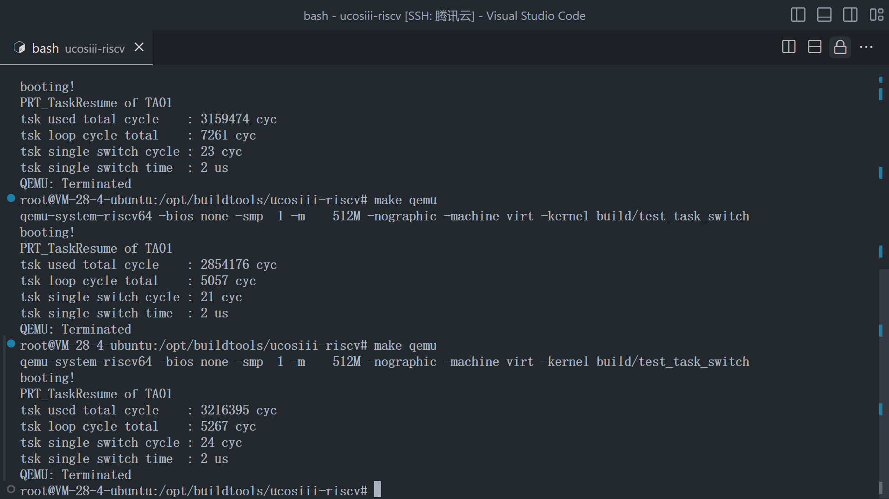
  - **UniProton**
  - 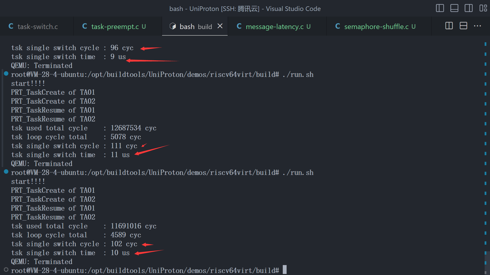
- **任务抢占**
  - **uC-OS3**
  - 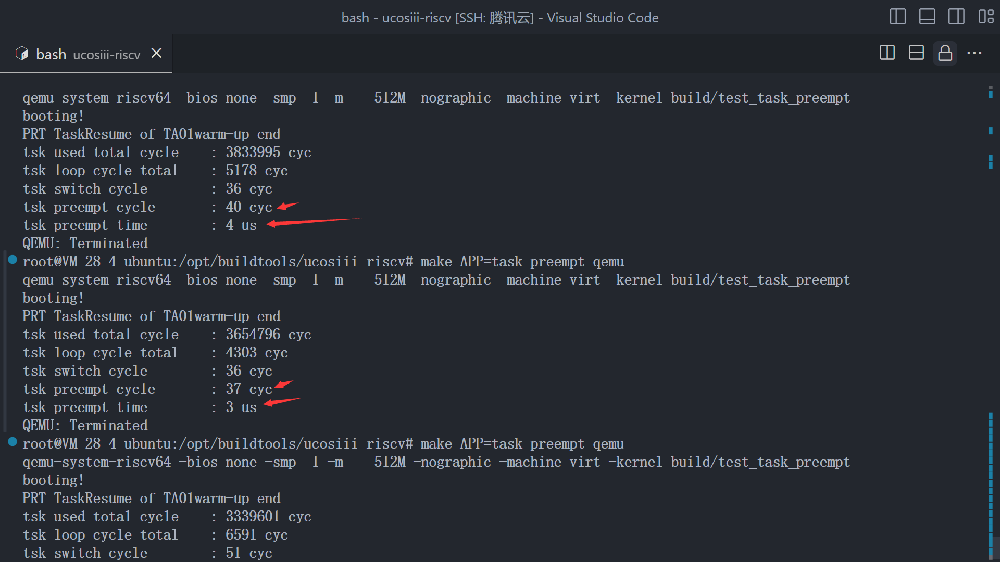
  - **UniProton**
  - 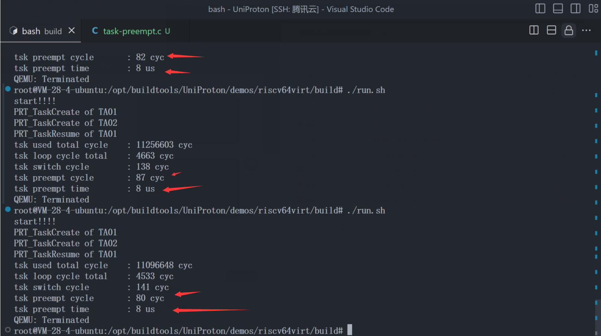
- **信号量混洗**
  - **uC-OS3**
  - 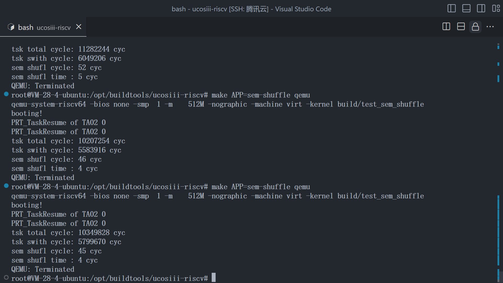
  - **UniProton**
  - 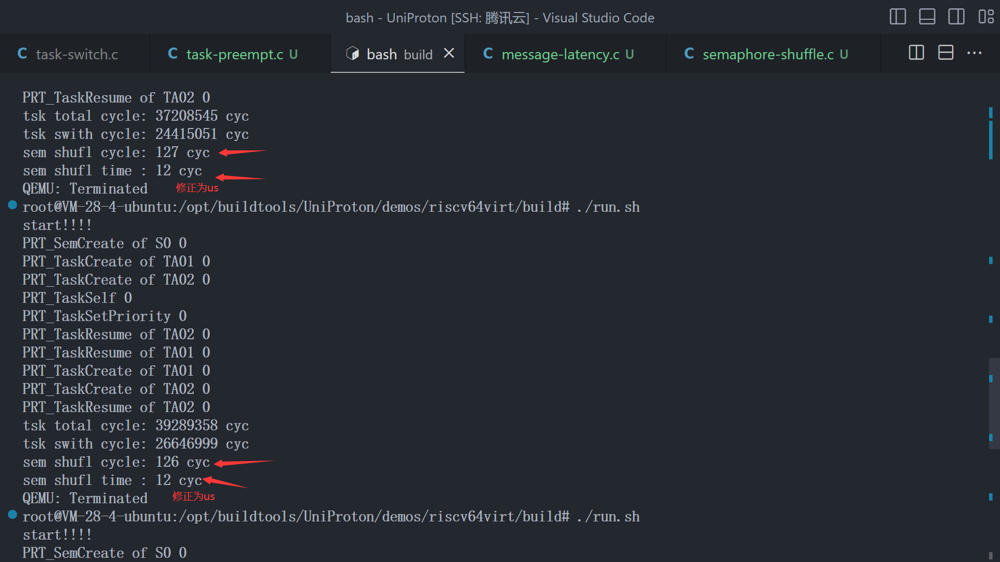
- **消息队列延迟**
  - **uC-OS3**
  - 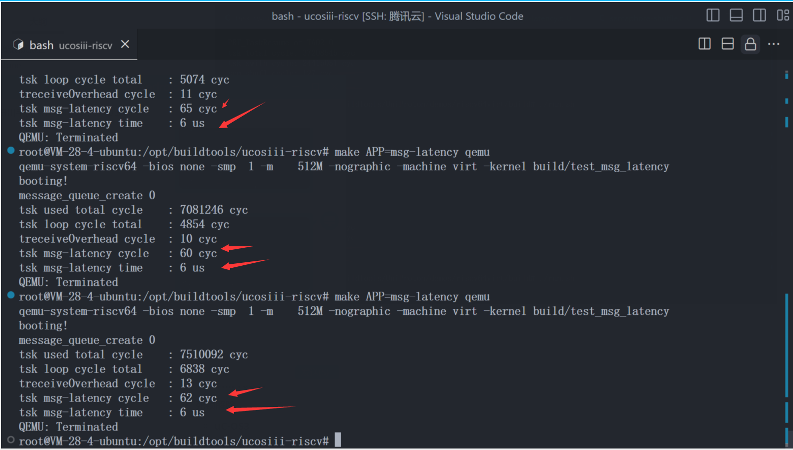
  - **UniProton**
  - 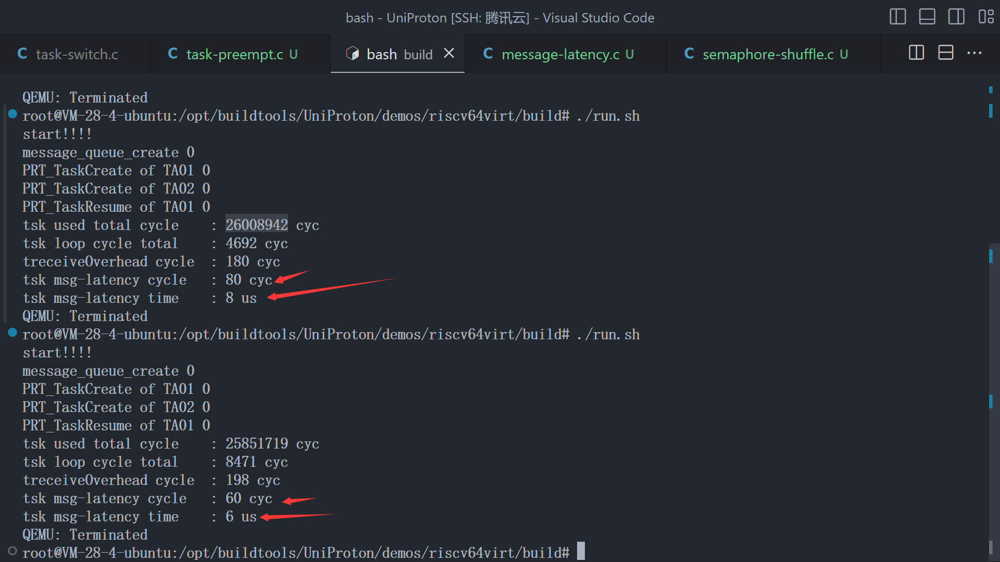
- **死锁解除**
  - **uC-OS3**
  - 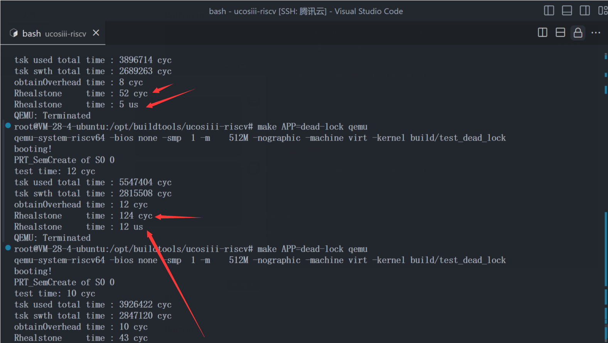
  - **UniProton**
  - 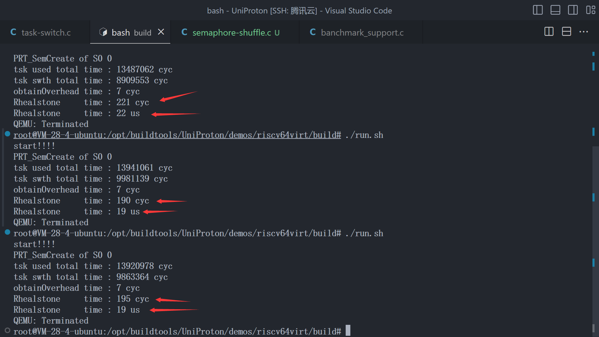

### 测试结果分析

- **说一点个人感受**

  - 首先是测试结果吧，从测试结果来看，UCOSIII 与UniProton 在 消息队列延迟上面相当，其他方面普遍高于 UniProton，这个结果是否说明UCOSIII 比 UniProton更好，我们更应该用UCOSIII？直接抛结论，不是，我对什么时候应该用什么的见解很简单： **抛开实际使用环境谈性能，谈数值就是耍流氓**。UniProton有 UniProton的优势，混合部署，软件生态，以及开发者友好的兼容其他RTOS的层，以及更强大的功能，包括接入了中断管理，软件异常管理等等，可以与Linux 进行混合部署。举一个实际使用例子来说明，**某个车载芯片，多核异构，性能强大，我想要有Linux 的丰富的管理能力和生态，也想要RTOS实时帮助我对一些实时性高的任务进行调度，比如刹车响应等。而车载刹车响应任务的实时性要求UniProton的硬性要求是达标的，UCOSIII也是达标的，此时我们会选择UniProton，因为有更强大，更方便的功能**。另一种情况，**UniProton的实时性硬性不达标，UCOSIII达标，我们在开发过程中也不需要使用很多功能，这些额外功能对我们的系统是冗余的，要求是轻量级系统，我们当然会首先选择UCOSIII。**
  - 从开发者的角度来看，有不足正是我们兴奋的地方，我们要做的不是去谈论数值，【数值肯定是有意义的，但是作为开发者纯粹的数值论就有点局限了】，我们需要做的是参与到其中，找到原因并优化，为完善UniProton贡献自己作为开发者的力量。
  - 最后是感谢提出这个问题的前辈，不然也不会有这么一次的测试，为后续的完善方向又有了新的方向

- **为什么实时性会比UCOSIII差？【重点! 重点! 重点!】**

  - 主要原因 

    - 为什么所有的测试性能都普遍低一点？
      - 所有的测试中都会有一个流程， **将某个TCB 放到 就绪队列，调整调度器相关数据结构的状态，然后选择一个优先级最高的TCB**
      - 这是UCOSIII的做法
        - 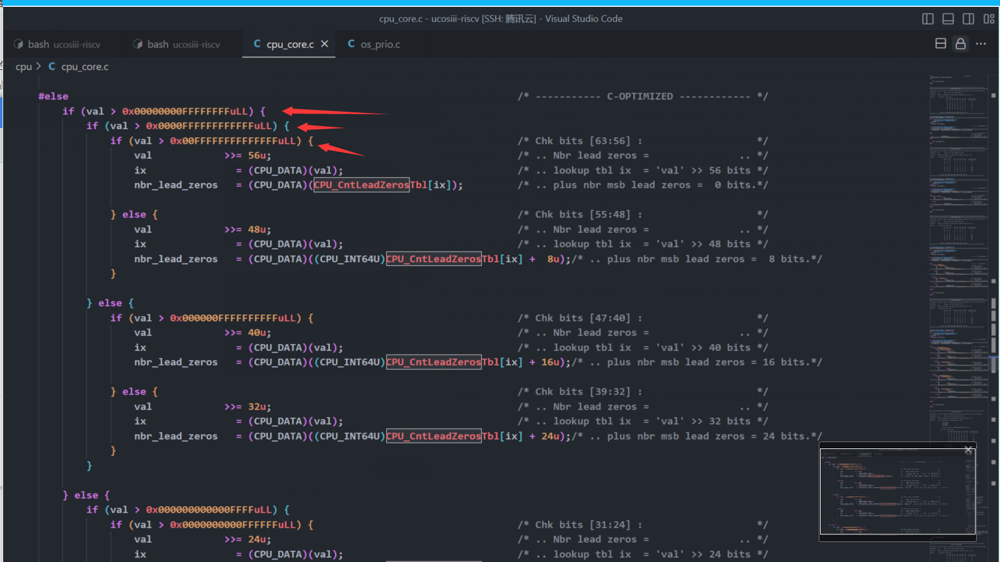
      - 这是UniProton的做法
        - 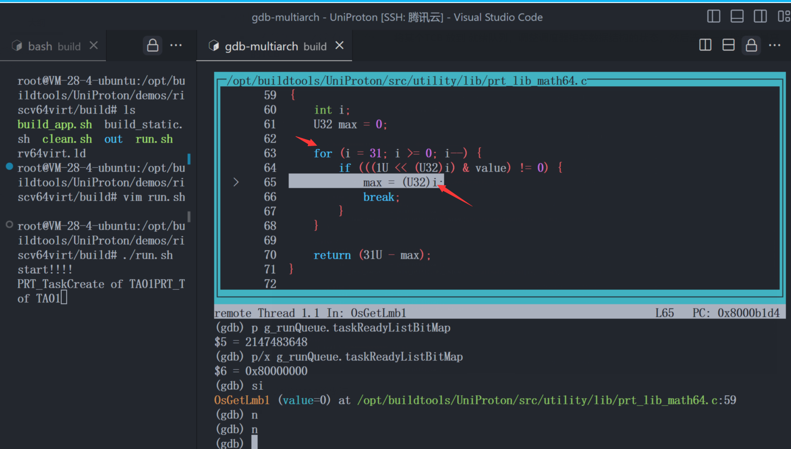
      - UCOSIII 在优先级bit图中，找到优先级最高的 bit ，也就是任务的时候，最多不超过3次 if的压栈！，而 UniProton的做法是一个for循环，最坏的情况可能是32循环，而且根据我的调试来看，大多数时候都会有7 - 8 次的循环，而对于这种周期级别的延迟来说，一个循环是比较致命的，UCOSIII在做这一步的时候也会根据不同架构提供汇编优化，所以这是UCOSIII 测试表现比较好的最重要的原因！
      - 这里是我认为的最有可能的原因，我们下一步要做的就是，解析uniproton的调度器，解析 UCOSIII开源出来的代码的调度器，然后尝试重构UniProton的调度器！
  - 现在是2024-02-18 几天的调试测试后，又使用汇编优化调度算法之后，发现其实并不能带来太大的优化，发现可能性最大的原因在于： UniProton 系统功能复杂度 比 uCOS-3 要大，所以会多做一些安全性的额外检查，比如经常会多一些系统状态字复位置位等，以及进入调度器的一系列状态检查，慢慢堆起来就复杂度变高了。  一个系统还是不能做到十全十美的，安全性，移植性，性能表现，支持功能等都会有取舍，安全性变高，支持功能变多，不可避免的会导致性能表现变差，尽自己可能多做一些小优化，优化虽小，聊胜于无。
  
  