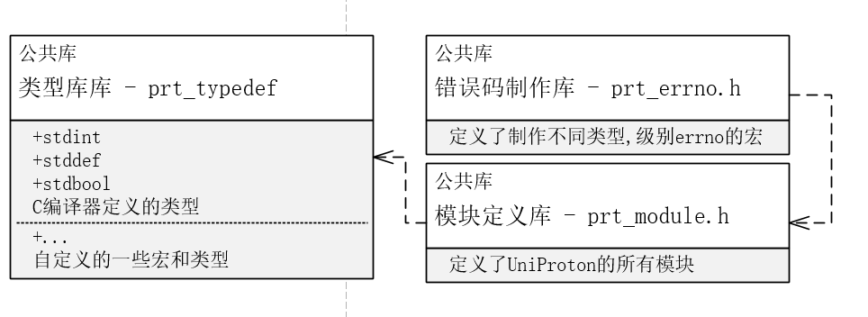

# UniProton 基础公共库文档

[TOC]

## 公共库 - 类型库

- **所在文件		     : **  `src/include/uapi/prt_typedef.h`

- **库作用		        ：** 定义一系列其他库和其他模块依赖的类型

- **依赖库或依赖模块     ：** GNU-C编译器的类型头文件 `stdint.h` `stddef.h` `stdbool.h`

- **所有定义的类型【无漏缺】**

  - **类型定义**

  - | 类型       | 意义                           |
    | ---------- | ------------------------------ |
    | U8         | 无符号byte                     |
    | U16        | 无符号short                    |
    | U32        | 无符号int                      |
    | U64        | 无符号long long                |
    | S8         | 有符号byte                     |
    | S16        | 有符号short                    |
    | S32        | 有符号int                      |
    | S64        | 有符号long long                |
    | VirtAddr   | void *                         |
    | PhyAddr    | void *                         |
    | OsVoidFunc | 参数为空且返回值为空的函数指针 |

  - **宏定义**

  - | 宏定义                | 意义                                                         |
    | --------------------- | ------------------------------------------------------------ |
    | OS_SEC_ALW_INLINE     | 无 [此处未揣测出原作者的意义]                                |
    | OS_EMBED_ASM          | 内联汇编宏   使用方法(riscv):	OS_EMBED_ASM("csrr t0,mhartid"); |
    | INLINE                | 静态inline宏，宏定义的函数替代，使用这个宏声明函数为内联静态函数 |
    | ALIGN(addr,boundrary) | 地址对齐宏(向上),boundrary为2的幂                            |
    |                       | 使用方法:ALIGN(0x321432,0x1000)=0x322000  ALIGN(0x321000,0x1000)=0x321000 |
    | TRUNCATE(addr, size)  | 地址对齐宏(向下),boundrary为2的幂                            |
    |                       | 使用方法:   TRUNCATE(0x321432,0x1000)=0x321000               |
    | YES                   | 1                                                            |
    | NO                    | 0                                                            |
    | TRUE                  | (bool)1                                                      |
    | FALSE                 | (bool)0                                                      |
    | NULL                  | (void*)0                                                     |
    | OS_ERROR              | (U32)(-1)                                                    |
    | OS_INVALID            | -1                                                           |
    | OS_OK                 | 0                                                            |
    | OS_FAIL               | 1                                                            |
    | U8_INVALID            | 0xffU                                                        |
    | U12_INVALID           | 0xfffU                                                       |
    | U16_INVALID           | 0xffffU                                                      |
    | U32_INVALID           | 0xffffffffU                                                  |
    | U64_INVALID           | 0xffffffffffffffffUL                                         |
    | U32_MAX               | 0xFFFFFFFFU                                                  |
    | S32_MAX               | 0x7FFFFFFF                                                   |
    | S32_MIN               | (-S32_MAX-1)                                                 |
    | LIKELY(x)             | 判断x是否为真                                                |
    | UNLIKELY(x)           | 判断x是否为假                                                |

- **模块`UML`图及与其他模块的耦合**
  - 

## 公共库 - 模块库

- **所在文件		     : **  `src/include/uapi/prt_module.h`

- **库作用		        ：** 定义了UniProton的所有模块

- **依赖库或依赖模块     ：** [prt_typedef](#公共库 - 类型库) 

- **所有定义的模块【无缺漏】**

  - | 模块           | 意义                                                         |
    | -------------- | ------------------------------------------------------------ |
    | OS_MID_SYS     | 系统模块                                                     |
    | OS_MID_MEM     | 内存模块                                                     |
    | OS_MID_FSCMEM  | 内存模块 【未被使用过，可能是原作者想要在管理算法上面做不同层次的内存模块】 |
    | OS_MID_TSK     | 任务模块                                                     |
    | OS_MID_SWTMR   | .模块  【目前尚未进行到此，若后续进行制到此填充】            |
    | OS_MID_TICK    | TICK模块                                                     |
    | OS_MID_CPUP    | CPU使用率计算模块                                            |
    | OS_MID_SEM     | 信号量模块                                                   |
    | OS_MID_HWI     | 硬件中断模块                                                 |
    | OS_MID_HOOK    | 钩子函数模块                                                 |
    | OS_MID_EXC     | 异常模块                                                     |
    | OS_MID_EVENT   | 事件模块                                                     |
    | OS_MID_QUEUE   | 消息队列模块                                                 |
    | OS_MID_TIMER   | 软件定时器模块                                               |
    | OS_MID_HARDDRV | .模块  【目前尚未进行到此，若后续进行制到此填充】            |
    | OS_MID_APP     | APP模块                                                      |
    | OS_MID_SIGNAL  | 信号模块                                                     |
    | OS_MID_SHELL   | SHELL模块                                                    |

- **模块`UML`图及与其他模块的耦合**

  - 

## 公共库 - 错误码库

- **所在文件		     : **  `src/include/uapi/prt_errno.h`

- **库作用		        ：** 定义一系列制作错误码的宏，包括制作不同级别，不同模块的错误码

- **依赖库或依赖模块     ：** [prt_typedef](#公共库 - 类型库)  [prt_module](#公共库 - 模块库)

- **所有定义**

  - | 定义宏               | 意义                                                         |
    | -------------------- | ------------------------------------------------------------ |
    | ERRNO_OS_ID          | OS错误码标记位，0x00表示OS **[其他模块基本不用，不作为PORT向其他内核模块的宏]** |
    | ERRTYPE_NORMAL       | 定义错误的等级:提示级别 **[其他模块基本不用，不作为PORT向其他内核模块的宏]** |
    | ERRTYPE_WARN         | 定义错误的等级:告警级别 **[其他模块基本不用，不作为PORT向其他内核模块的宏]** |
    | ERRTYPE_ERROR        | 定义错误的等级:严重级别 **[其他模块基本不用，不作为PORT向其他内核模块的宏]** |
    | ERRTYPE_FATAL        | 定义错误的等级:致命级别 **[其他模块基本不用，不作为PORT向其他内核模块的宏]** |
    | OS_ERRNO_BUILD_FATAL | **定义OS致命错误码且PORT向其他模块的宏** ,宏需要两个参数 **一是模块号 二是错误号** |
    | (mid, errno)         | 使用方法:**定义一个内存模块的1号错误码  OS_ERRNO_BUILD_FATAL(OS_MID_MEM,0x1)** |
    | OS_ERRNO_BUILD_ERROR | **定义OS严重错误码且PORT向其他模块的宏**,宏需要两个参数 **一是模块号 二是错误号** |
    | (mid, errno)         | 使用方法:**定义一个内存模块的2号错误码  OS_ERRNO_BUILD_ERROR(OS_MID_MEM,0x1)** |

- **模块`UML`图及与其他模块的耦合**

  - 

## 公共库 - 架构信息定义库

- **所在文件		     : **  `src/include/uapi/prt_buildef_common.h`

- **库作用		        ：** 定义架构信息，如存在多少个平台架构，多少种类型的CPU

- **依赖库或依赖模块     ：** 无

- **注意事项**		     :   **此模块会和prt_buildef模块一同确定用户选择需要编译的内核模块和选择的内核特性**

- **所有定义【仅PORT出去会被内核其他模块或用户使用的宏】**

  - | 宏定义              | 意义                                                      |
    | ------------------- | --------------------------------------------------------- |
    | OS_LITTLE_ENDIAN    | **小端的宏意义值，用于在prt_builddef 中来确定硬件大小端** |
    | OS_BIG_ENDIAN       | **大端的宏意义值，用于在prt_builddef 中来确定硬件大小端** |
    | OS_CORTEX_M4        | **定义的CORTEX_M4架构意义值**                             |
    | OS_ARMV8            | **定义的ARMV8架构意义值**                                 |
    | OS_X86_64           | **定义的X86_64架构意义值**                                |
    | OS_RISCV64G         | **定义的RISCV64G架构意义值**                              |
    | OS_PLATFORM_INVALID | **最大的无意义的值**                                      |
    | OS_STM32F407        | **定义的STM32F407CPU意义值**                              |
    | OS_RASPI4           | **定义的RASPI4 CPU意义值**                                |
    | ...                 | ...                                                       |
    | OS_RV64_VIRT        | **定义的RV64_VIRT CPU意义值**                             |
    | OS_CPU_TYPE_INVALID | **最大的无意义的值**                                      |
    | INIT_SEC_L4_TEXT    | **猜测是原作者想用这个宏表示某个函数是初始化函数**        |
    | RESET_SEC_DATA      | **猜测是原作者想用这个宏表示某个函数是初始化数据段**      |

- **模块`UML`图及与其他模块的耦合**

  - 

## 公共库 - 架构信息定义库-私有架构板补充

- **所在文件		     : **  `src/include/uapi/prt_buildef.h` **[由构建框架生成，需要用户指定选择的模块，不必在意路径]**

- **库作用		        ：** 定义架构信息，如CPU类型，架构类型，选择的模块，选择的特性
- **依赖库或依赖模块     ：** 无
- **注意事项**		     :   **此模块会和prt_buildef_common模块一同确定用户选择需要编译的内核模块和选择的内核特性**
- **所有定义【仅PORT出去会被内核其他模块或用户使用的宏】**
  - **此处需要自行查看deconfig内容，非常多，我也囊括不完**
- **模块`UML`图及与其他模块的耦合**
  - 

## 公共库 - 编译器段属性定义库

- **所在文件		     : **  `src/arch/include/prt_attr_external.h`移植需要联合架构进行实现，我的实现在`src/arch/cpu/riscv64G/common/os_attr_riscv64g_external.h`

- **库作用		        ：** 定义所有的函数和数据的所有段属性

- **依赖库或依赖模块     ：** 无

- **注意事项**		     :   **此模块需要移植者联合架构一起实现**

- **所有定义【仅PORT出去会被内核其他模块或用户使用的宏】**

  - | 宏定义         | 意义                                                         |
    | -------------- | ------------------------------------------------------------ |
    | OS_SEC_L0_TEXT | L0表示最高性能内存段                                         |
    | OS_SEC_TEXT    | OS_SEC_L1_TEXT, L1表示性能敏感内存段，如PL2，默认缺省，不显示指定 |
    | OS_SEC_L2_TEXT | 性能级别为L2的TEXT段落                                       |
    | OS_SEC_L4_TEXT | 性能级别为L4的TEXT段落                                       |
    | OS_SEC_DATA    | 性能敏感数据段                                               |
    | OS_SEC_L4_DATA | 性能级别为L4的数据段落                                       |
    | OS_SEC_BSS     | 性能敏感BSS数据段                                            |
    | OS_SEC_L4_BSS  | 性能级别为L4的BSS数据段落                                    |

    

- **模块`UML`图及与其他模块的耦合**

  - 

## 公共库 - CPU资源定义库

- **所在文件		     : **  `src/arch/include/prt_cpu_external.h`移植需要联合架构进行实现，我的实现在`src/arch/cpu/riscv64G/common/os_cpu_riscv64g_external.h`

- **库作用		        ：** 定义所有与CPU相关的资源信息，提供给其他可能用到的模块，比如异常模块和中断模块

- **依赖库或依赖模块     ：** 无

- **注意事项**		     :   **此模块需要移植者联合架构一起实现，定义的内容很杂，作为一些硬件相关模块的基础，需要仔细对比进行移植**

- **所有定义【仅PORT出去会被内核其他模块或用户使用的宏】**

  - | 宏定义 | 意义 |
    | ------ | ---- |
    |        |      |
    |        |      |
    |        |      |
    |        |      |
    |        |      |
    |        |      |
    |        |      |
    |        |      |
    |        |      |

- **模块`UML`图及与其他模块的耦合**

## 公共模块 -  ERROR模块

- **所在文件		     : **  `src/include/uapi/prt_err.h`  `src/om/err/*` `src/om/include/prt_err_external.h`

- **库作用		        ：** 

- **依赖库或依赖模块     ：** [prt_typedef](#公共库 - 类型库)  [prt_module](#公共库 - 模块库) [prt_attr](#公共库 - 编译器段属性定义库)  [prt_cpu](#公共库 - CPU资源定义库) prt_task [prt_hook](#公共模块 - hook模块) prt_exc

- **所有定义**

  - | 接口                               | 意义                                                         |
    | ---------------------------------- | ------------------------------------------------------------ |
    | PRT_ErrRegHook(ErrHandleFunc hook) | [PORT TO USER] 注册ERR模块处理的回调函数，注册到HOOK模块里去 |
    |                                    | 注册的回调函数类型为单钩回调                                 |
    | PRT_ErrHandle()                    | [PORT TO USER] 用户调用的错误处理函数                        |
    | OsErrRecord()                      | [PORT TO OTHER KENEL]                                        |
    |                                    | 若当前发生错误是在任务中，则记录到任务的ERRNO中              |
    | OS_ERR_RECORD()                    | [PORT TO OTHER KENEL]                                        |
    |                                    | 将错误码记录到ERROR模块的数据结构里，而不是任务的ERRNO中     |
    | OS_REPORT_ERROR()                  | [PORT TO OTHER KENEL]                                        |
    |                                    | 若当前发生错误是在任务中，则记录到任务的ERRNO中 ,与 OsErrRecord |
    |                                    | 不同的是，会执行用户的回调钩子，同时严重错误时会引起异常，触发EXC模块 |

- **模块`UML`图及与其他模块的耦合**

  - 

## 公共库 - 内存库

- **所在文件		     : **  `src/include/uapi/prt_mem.h`  `src/mem/*`

- **库作用		        ：** 用户配置初始化后，作为基础内存分配库存在于众内核间
- **依赖库或依赖模块     ：** [prt_typedef](#公共库 - 类型库)  [prt_module](#公共库 - 模块库) [prt_attr](#公共库 - 编译器段属性定义库)  [prt_cpu](#公共库 - CPU资源定义库)
- **所有定义**

  - | 接口              | 意义                                                         |
    | ----------------- | ------------------------------------------------------------ |
    | PRT_MemAlloc      | 在分区号为ptNo的分区中，申请大小为size的内存。【实际没有实现分区号和模块号】 |
    | PRT_MemAllocAlign | 在分区号为ptNo的分区中，申请大小为size的内存，对齐方式为alignPow |
    | PRT_MemFree       | 该接口根据内存块的地址addr，                                 |
    | 以上接口为        | PORT TO USER 的接口                                          |
    | OsMemAllocAlign   | 在分区号为ptNo的分区中，申请大小为size的内存，对齐方式为alignPow |
    | OsMemAlloc        | 在分区号为ptNo的分区中，申请大小为size的内存。               |
    | 以上接口为        | PORT TO KERNEL的接口                                         |

- **模块`UML`图及与其他模块的耦合**

  - 

## [公共模块 - hook模块](UniProton_hook_module.md)

- **所在文件		     : **  `src/include/uapi/prt_hook.h` `src/om/hook/*` `src/om/include/hook_external.h` 

- **库作用		         ：** 内部维护了与钩子有关的数据结构，可以注册某个模块多个钩子或者单个钩子，使用提供的API激活钩子

- **注意事项		     ：** **有些历史年代了，有些数据结构未使用过，等等**

- **依赖库或依赖模块      ：** [prt_typedef](#公共库 - 类型库)  [prt_module](#公共库 - 模块库) [prt_mem](#公共库 - 内存库) [prt_attr](#公共库 - 编译器段属性定义库)  [prt_cpu](#公共库 - CPU资源定义库)

- **所有API【其他模块使用的，这个模块的API不能被用户使用**

  - | API                                       | 意义                                                |
    | ----------------------------------------- | --------------------------------------------------- |
    | OsMhookAdd                                | 多钩子添加内部接口                                  |
    | OsMhookDel                                | 多钩子删除内部接口                                  |
    | OsHookAdd                                 | 钩子添加内部接口                                    |
    | OsHookDel                                 | 钩子删除内部接口                                    |
    | OsShookReg                                | 单钩子注册内部接口，                                |
    | OsMhookReserve                            | 在注册阶段，不同模块通过osMhookReserve接口预留钩子, |
    | OS_SHOOK_ACTIVATE_PARA0(hookType)         | 激活hookType的单钩子,参数为0个                      |
    | OS_SHOOK_ACTIVATE_PARA1(hookType,param_1) | 激活hookType的单钩子,参数为1个                      |
    | OS_SHOOK_ACTIVATE_PARA2(hookType,...)     | 激活hookType的单钩子,参数为2个                      |
    | OS_SHOOK_ACTIVATE_PARA3(hookType,...)     | 激活hookType的单钩子,参数为3个                      |
    | OS_SHOOK_ACTIVATE_PARA4(hookType,...)     | 激活hookType的单钩子,参数为4个                      |
    | OS_SHOOK_ACTIVATE_PARA5(hookType,...)     | 激活hookType的单钩子,参数为5个                      |
    | OS_MHOOK_ACTIVATE_PARA0(hookType)         | 激活hookType的多钩子,参数为0个                      |
    | ...                                       |                                                     |
    | OS_MHOOK_ACTIVATE_PARA5(hookType,...)     | 激活hookType的多钩子,参数为5个                      |

    

- **模块`UML`图及与其他模块的耦合**

  - 

