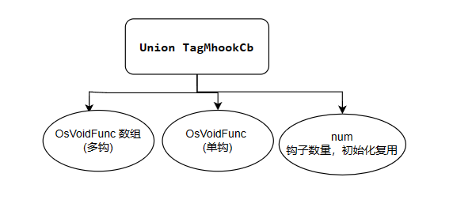
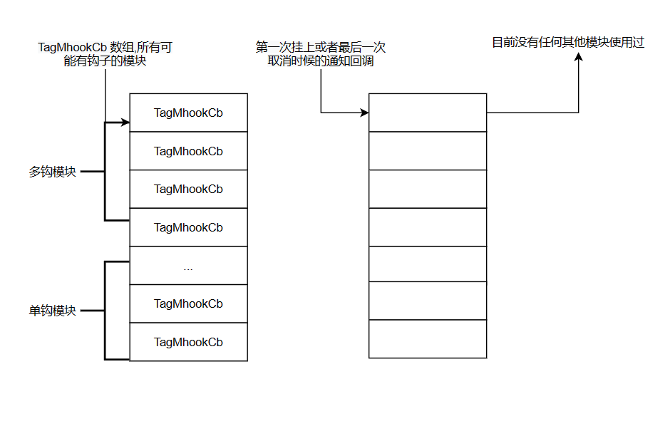

# Hook模块详解

# 专门出个文档讲一下Hook模块

- **内部数据结构**
- **Union TagMhookCb** : 用来保存模块钩子回调函数的结构体，union 在初始化的时候复用为钩子的数量，对于多钩模块，可以注册多个钩子，也可以同时全部激活，单钩模块只能注册一个钩子
- 
- **钩子数组**
- 
- 钩子数组的数量是模块的数量，每个模块都有自己的钩子函数，所有的多钩模块在前面，单钩模块在后面
- **Port的API**
  - **Config And Init API**
    - `OsHookRegister(struct HookModInfo *modInfo)`
    - 其中 modInfo 结构体内会带着所有多钩模块的初始化钩子数目
    - OsHookConfigInit(void)
    - config由初始化调用，会调用注册的memalloc的回调函数，为每个多钩子模块分配钩子的内存，方便后续把钩子注册进去

