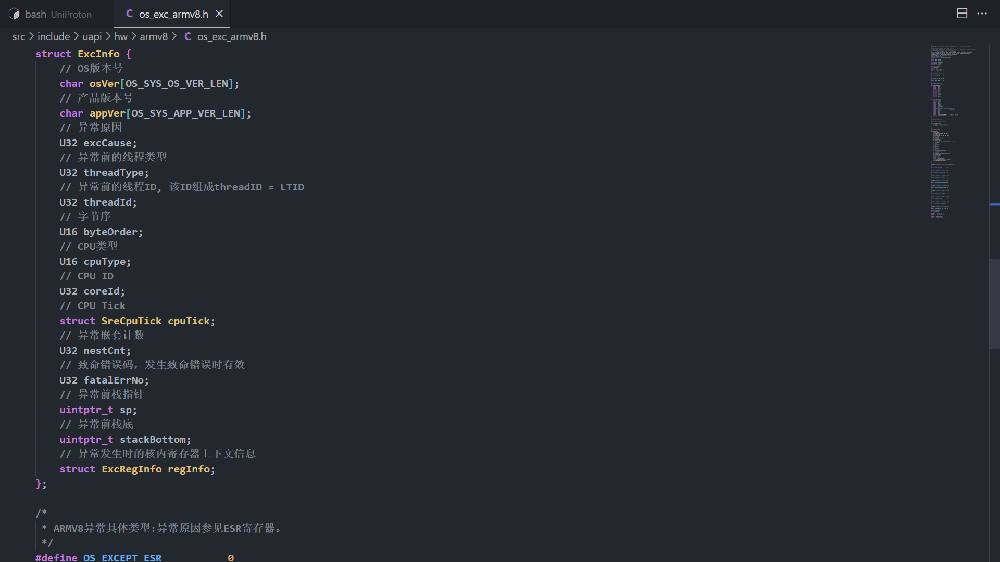
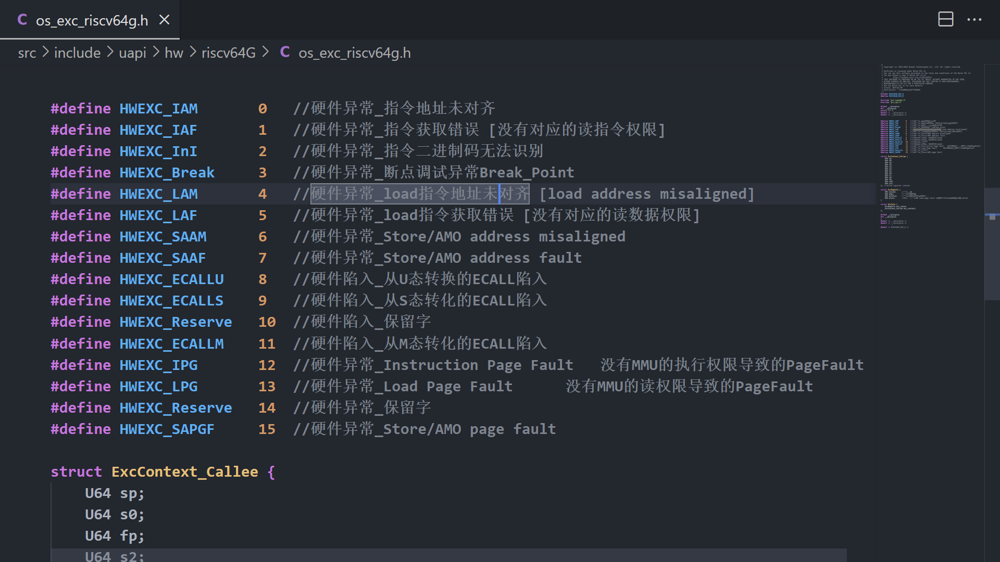
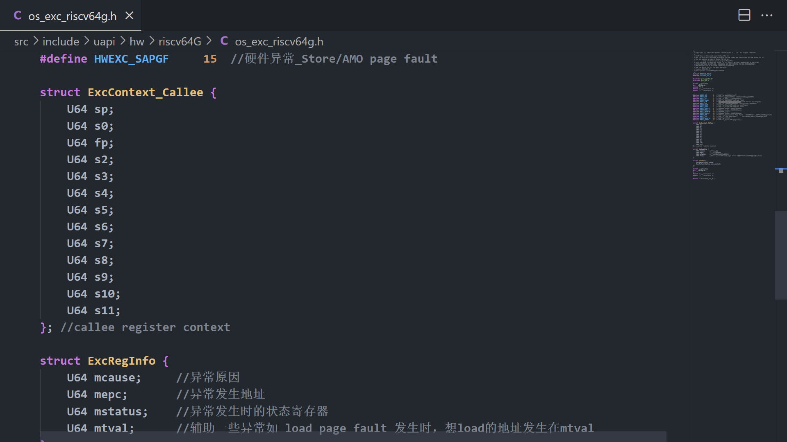
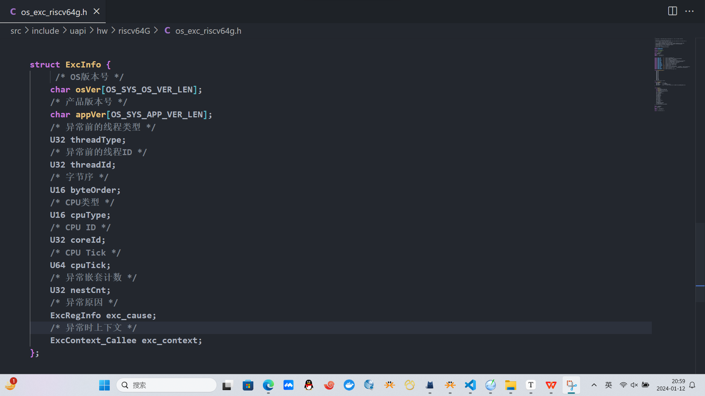

# UniProton Kernel 软件架构以及移植指南		- Jer6y

## 前言

- **UniProton** 作为 openEuler 的一款**嵌入式实时内核**，既支持了单核MCU，也支持了**多核强力的CPU** 【这个是许多RTOS不支持的，比如UCOSIII 以及 TencentOSTiny】，UniProton也为开发者提供了相当多的API接口，原生的**UAPI**，以及**LIBC接口**，和后续可能会实现的**POSIX接口**，以及特殊的**KAL层接口**，提供了许多组件库，如**NET协议栈组件库**，**SHELL组件库**，当然在配置上也是十分灵活，支持用户通过预编译宏裁剪模块等。很有幸能够尝试对UniProton Kernel 进行RISCV的移植 。谈及Kernel ， 就不得不谈到架构，硬件问题，因为Kernel 会实时和这些东西打交道，因此移植一个Kernel 需要牵涉到的模块也繁多。此次的移植过程中，笔者希望自己能够掌握UniProton Kernel 的**软件架构**，学习项目在如此强耦合的情况下如何去**解耦**，让UniProton 成为一个移植性十分可观的Kernel ，同时此次也会以**UML图**的形式对各个模块进行剖析，**对模块间的关系进行剖析**。
- 如果您对我的工作**感兴趣**，可以**随时联系我**，我的githubid : **Jer6y**
- 如果您想要参与**与我一同工作**，也欢迎加我的微信： **Jer6y**

### 软件框架模块图

- 下面通过对**各个独立模块**进行解析，**再合并**的形式进行**软件框架**解析
- **红色部分** **- 移植需要完成的部分**    **橙色部分 -   强调部分**

### 基础公共库

- [基础公共库文档](UniProton_Base.md)

### 异常模块


- 该模块牵涉到的所有文件

  - ```shell
    src/include/prt_exc.h
    ```

  - ```shell
    src/core/kernel/kexc/prt_kexc.c
    ```

  - ```shell
    src/core/kernel/include/prt_kexc_external.h
    ```

  - ```shell
    src/arch/include/prt_exc_external.h
    ```

  - ```shell
    src/arch/cpu/.../common/prt_exc.c            -> 自己移植实现
    ```

  - ```shell
    src/uapi/hw/../ xxx.h 	             		 -> 自己移植实现
    ```

  - ```c
    src/arch/cpu/.../common/prt_exc.s            -> 自己移植实现
    ```
  
    

- 总述异常模块的作用

  - **对开发者**  

    - 为其提供可以进行**hook**的回调函数用于**DUMP异常信息** ， 其中记录异常时各个寄存器的信息都放在**struct ExecInfo** 中 ，这个结构体，移植者**需要关注** 

  - **对其他内核模块** 

    - 提供**上一次发生异常时**刻的记录信息

    - 查询目前**是否处于异常处理中** 以及处于**异常嵌套的层次** 

    - **高级玩法：软件异常的定义和构建**

      - 在判断软件异常为真时，配合 struct ExecInfo 进行软件异常DUMP ，下为示例

        - ```c
           int add(int a,int b); 
           //要求 a>=0 && b>=0 返回值应该 >=0 若返回值<0 则默认加法越界，此处定义为我想要捕捉的软件异常
           //此情此景，硬件异常是无法实现的，因为这完全是一个正常的运行流程，同时加法溢出在ALU里是不会被认为异常的
          ```

        - ```c
          int add(int a,int b)
          {
              if(a<0 || b<0)
              {
                  OsExcDispatch();
          	}
              return a+b;
          }
          int main()
          {
              int c = 0x7fffffff;
              int d = 0x7fffffff;
              int ret = add(c,d);
              if(ret < 0)
              {
                  OsExcDispatch(); //此处使用异常模块接口，进入异常同时死掉
              }
          }
          ```

        - 发生软件异常后，会进入OSExcDispatch进行异常处理，如果此时再配合上struct ExecInfo 如果不只存放发生异常时刻的各个硬件寄存器状态（这个对**软件异常参考意义不大 对硬件异常参考意义巨大**），而是有一些如任务状态信息，发生所在的任务，那么就非常好了。

        - **下面是我找到的os_exc_armv8.h中关于armv8架构的异常execinfo结构体实现。**

        - 

- 总述异常模块移植 - 主要是需要移植**硬件异常**，软件异常的功能拓展目前待我移植完所有模块再进行

  - 添加文件`src/uapi/hw/riscv64G/os_exc_riscv64g.h`，添加结构体 struct ExcInfo

    - 
    - 
    - 

  - 添加文件`src/arch/cpu/riscv64G/common/prt_exc.c`

    - **根据ExcInfo** 的内容，写出**发生异常时加载到全局记录的函数** `OsExcSaveInfo`

    - ```c
      #include "prt_exc.h"
      #include "prt_exc_external.h"
      
      // 异常时获取当前任务的信息
      OS_SEC_BSS ExcTaskInfoFunc g_excTaskInfoGet;
      
      // 异常callee 寄存器记录
      OS_SEC_BSS struct ExcCalleeInfo g_excCalleeInfo;
      
      // 异常cause  寄存器记录
      OS_SEC_BSS struct ExcCauseRegInfo g_causeRegInfo;
      
      /*
       * 描述: 获取异常前的线程信息
       */
      OS_SEC_ALW_INLINE INLINE void OsExcSetThreadInfo(struct ExcInfo *excInfo)
      {
          U32 threadId = INVALIDPID;
          struct TskInfo taskInfo = {0};
      
          if (g_excTaskInfoGet != NULL) {
              g_excTaskInfoGet(&threadId, &taskInfo);
          }
      
          /* 记录发生异常时的线程ID，发生在任务和软中断中，此项具有意义，其他线程中，此项无意义 */
          excInfo->threadId = INVALIDPID;
      
          /* 设置异常前的线程类型 */
          if (OS_INT_COUNT > 0) {
              excInfo->threadType = EXC_IN_HWI;
          } else if ((UNI_FLAG & OS_FLG_TICK_ACTIVE) != 0) {
              excInfo->threadType = EXC_IN_TICK;
          } else if ((UNI_FLAG & OS_FLG_SYS_ACTIVE) != 0) {
              excInfo->threadType = EXC_IN_SYS;
          } else if ((UNI_FLAG & OS_FLG_BGD_ACTIVE) != 0) {
              excInfo->threadType = EXC_IN_TASK;
              if (OsTskMaxNumGet() > 0) { /* 任务存在时 */
                  excInfo->threadId = threadId;
              }
          } else { /* OS_FLG_BGD_ACTIVE没有置位，代表此时还在系统进程中，没有进入业务线程 */
              excInfo->threadType = EXC_IN_SYS_BOOT;
          }
      
          /* 任务栈栈底 */
          if (excInfo->threadType == EXC_IN_TASK) {
              excInfo->stackBottom = TRUNCATE((taskInfo.topOfStack + taskInfo.stackSize), OS_EXC_STACK_ALIGN);
          }
      }
      
      INIT_SEC_L4_TEXT void OsExcSaveInfo(struct ExcInfo *excInfo, struct ExcCalleeInfo *calleeInfo, struct ExcCauseRegInfo* regInfo)
      {
          /* 记录异常嵌套计数 */
          excInfo->nestCnt = CUR_NEST_COUNT;
      
          /* 记录os版本号 */
          if (strncpy_s(excInfo->osVer, sizeof(excInfo->osVer), PRT_SysGetOsVersion(), (sizeof(excInfo->osVer) - 1)) != EOK) {
              OS_GOTO_SYS_ERROR();
          }
          excInfo->osVer[OS_SYS_OS_VER_LEN - 1] = '\0';
      
          /* 记录CPU ID */
          excInfo->coreId = 0x0U;
      
          /* 设置字节序 */
          /* 魔术字 */
          excInfo->byteOrder = OS_BYTE_ORDER;
      
          /* 记录CPU类型 */
          excInfo->cpuType = OsGetCpuType();
      
          /* 记录CPU TICK值 */
          cycle = OsCurCycleGet64();
      
          /* 记录异常原因寄存器信息 */
          excInfo->excCause = *regInfo;
      
          /* 记录callee寄存器信息 */
          excInfo->excContext = *calleeInfo;
      
          /* 记录异常前栈底,系统栈栈底 */
          excInfo->stackBottom = (uintptr_t)&__os_sys_sp_end;
          
          OsExcSetThreadInfo(excInfo);
      }
      
      
      /*
       * 描述：EXC模块的处理分发函数
       */
      // not done yet
      OS_SEC_L4_TEXT void OsExcHandleEntryRISCV()
      {
          CUR_NEST_COUNT++;
          
      }
      ```

  - 添加文件`src/arch/cpu/riscv64G/common/prt_exc.s`

    - 填写**真正在发现是异常时刻需要调用的函数** `OsExcDispatch`

    - 首先**需要及时对现场进行保存**，利用**t0**这个**caller**寄存器，对**callee进行保存**，再利用**t0**对 **异常记录相关的寄存器**进行保存

    - 再利用 **ABI手册** 规定的传参守则，把各个参数就位，**调用OsExcSaveInfo对参数解析和录入**

    - 最后调用**异常处理函数入口**`OsExcHandleEntryRISCV`

    - ```assembly
      .macro LOADEXECINFO
          .extern g_excCalleeInfo
          .extern g_causeRegInfo
          la t0 , g_excCalleeInfo
          sd sp , 0(t0)
          sd s0 , 8(t0)
          sd fp , 16(t0)
          sd s2 , 24(t0)
          sd s3 , 32(t0)
          sd s4 , 40(t0)
          sd s5 , 48(t0)
          sd s6 , 56(t0)
          sd s7 , 64(t0)
          sd s8 , 72(t0)
          sd s9 , 80(t0)
          sd s10, 88(t0)
          sd s11, 96(t0)  ;上面是在保存callee寄存器到全局变量g_excCalleeInfo
          la t0 , g_causeRegInfo 
          csrr t1 , mcause
          sd t1 , 0(t0)
          csrr t1 , mepc
          sd t1 , 8(t0)
          csrr t1 , mstatus
          sd t1 , 16(t0)
          csrr t1 , mtval
          sd t1 , 24(t0)  ;上面是在保存异常状态相关的寄存器到全局变量g_causeRegInfo
      .endm
      
      .section .text
      .global OsExcDispatch ;异常分发函数 - 异常处理函数 ,硬件异常的处理函数入口Entry
      OsExcDispatch:
          LOADEXECINFO
          .extern g_excInfoInternal
          .extern OsExcSaveInfo
          la a0 , g_excInfoInternal
          la a1 , g_excCalleeInfo
          la a2 , g_causeRegInfo
          call OsExcSaveInfo
          call OsExcHandleEntryRISCV
          ret
      ```

      